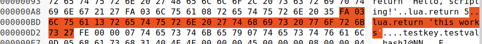
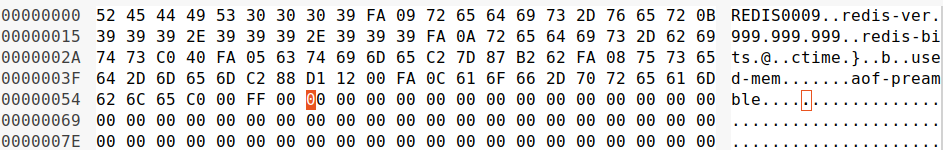
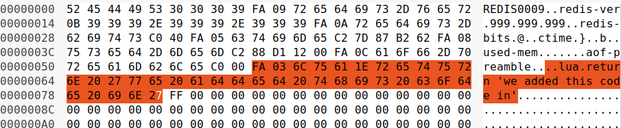

# Database File Editing

So for editing the database file, to cause certain database operations to snowball into other functionalities. First off, the traditional database leaking attack I've been trying to execute did not work against this database implementation. This is because of the database dump loading process. The database dump file is split up into individual pieces (probably has a more official name, I'm unaware of). It will actually iterate through the individual pieces, checking if it's valid (no strings that extend beyond the record). As such, the traditional database leak/edit attacks are not possible.

However I did discover one thing that was a bit interesting. So there are two types of "pieces" from what I've seen. The first is database records. The second type contains pieces of database metadata. Now one feature of this database, is it will allow you to make, save, and run lua scripts. These are saved in a particular type of database metadata piece. These can be edited, and made, which can then be successfully ran from the client without ever actually officially loading the lua script. However considering that you can load and then run lua scripts from the client, the usefulness of this is questionable.

For details about why this is, checkout `db_format.md` for details.

## Lua Script Editing 

So first, to show how to actually load an run a lua script:

```
127.0.0.1:6405> SCRIPT LOAD "return 'this works'"
"5a031c8dd3c6b8a03a1bb8928adf8f4010c11ce8"
127.0.0.1:6405> EVALSHA 5a031c8dd3c6b8a03a1bb8928adf8f4010c11ce8 0
"this works"
127.0.0.1:6405> save
OK
```

The hash generated is the sha-1 hash of the input lua text, which we see here:

```
$	echo -n "return 'this works'" | openssl sha1
(stdin)= 5a031c8dd3c6b8a03a1bb8928adf8f4010c11ce8
```

Now, let's cover the actual structure of a segment which will save

```
RDB_OPCODE_AUX		- 	Single byte 0xFA, signifies that it is an auxillary RDB piece
"lua" string 		-	length of 0x03, followed by string "lua", means it's a lua type RDB Aux piece
lua script 			-	length of the lua code in text, followed by a string of the actual lua script
```

Here is an example of the saved lua script, from the `"return 'this works'"` script from above:



So now to create a new piece that will have some lua scripting in it. This will be the lua script:

```
"return 'we added this code in'"
```

Which we see, `4a3dd6872b932726c6ccbc84cce7102e26b31945` is the sha1 hash of the lua script.

This will be the data of the new piece to hold the lua scripting in it:

```
$	echo -n "return 'we added this code in'" | openssl sha1
(stdin)= 4a3dd6872b932726c6ccbc84cce7102e26b31945
```

Now this is the database file (I created a new one) prior to me adding in the new piece:



This is the database save file after I add the new piece: 



And now, we see we can actually run the code we added in:

```
$	redis-cli -p 6405
127.0.0.1:6405> EVALSHA 4a3dd6872b932726c6ccbc84cce7102e26b31945 0
"we added this code in"
```

Again, considering that loading in and running lua code is a default feature, not too sure how useful this is. However in redis, there is an `ACL` command, which can configure a user to only use certain commands. This might be useful in a scenario where a user could only run existing lua scripts, not load additional ones, since it would give us a way to execute lua code we otherwise wouldn't be able to. Now ACL isn't currently supported by dragonfly, but according to this error message, it sounds like they have plans to add it in a future release (from `server_family.cc`). Either way, this is fairly non-substantial bug, that would be pretty hard to use in any practical sense:

```
  if (args.size() == 3) {
    return (*cntx)->SendError("ACL is not supported yet");
  }
```

