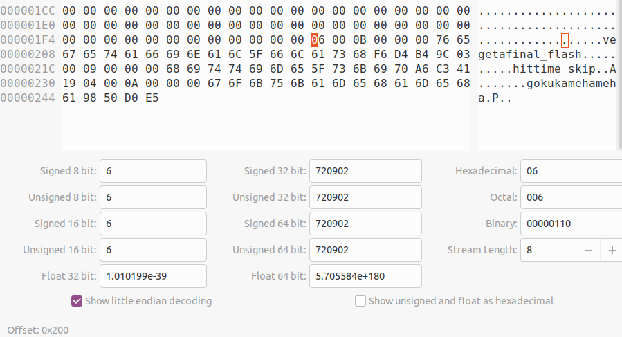
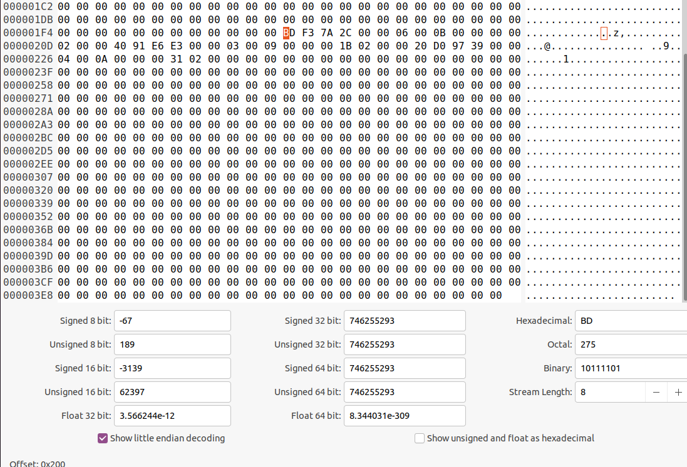
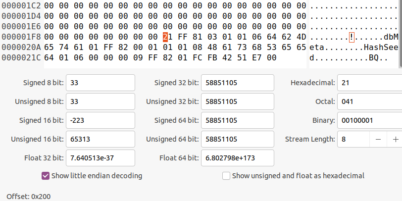

## Files

So this database will store it's data within several files, contained within a folder named after the database. Here is a list of them:

```
00000-1.psg 		-	Stores the actual data for a segment (so the records)
00000-1.psg.pmt 	-	Stores the metadata for the corresponding segment
db.pmt 				-	Stored Database Meta Information
index.pmt 			-	Stores Index Metadata
main.pix 			-	Stores Actual indices
overflow.pix 		-	Stores Index Overflow
```

So there are two main parts to this database, the datalog and the index. The datalog is what actually stores the data for a record, and the index is what stores information as to where the records are.

## Record Storage

So records are stored in the `00000-1.psg` file. We can see the actual format used to store records, which is this:

```
0x00:	two byte key size int value
0x02:	two byte value size int value
0x04:	two bytes of blank space
Key:	The key (unknown length)
Value:	The value (unknown length)
CRC:	Two byte checksum
```

Here we can see, the actual contents of the file. The records begin at offset `0x200`, as specified in the code:



We can see there are three different records (key/value pairs `vegeta/final_flash`, `hit/time_skip` and `goku/kamehameha`).

We can also see in the `00000-1.psg.pmt` file, it contains the metadata for the segment, which we see starts at offset `0x200`.

## Index Storage

So in the `main.pix` file, we see the actual offsets for the records. For each record, a specific offset is stored.

```
0x00:	4 byte hash
0x04:	2 byte segment ID
0x06:	2 byte key size
0x08:	2 byte value size
0x0a:	??? 2 null bytes (unsure)
0x0c:	4 byte int offset
```

Here we can see some indices:



We can see, there are three record offsets, with offsets `0x0200`, `0x021b`, `0x0231`.

We can also see in the `index.pmt` file, is the metadata for the indices.

## Metadata Storage

So the metadata is stored in the `db.pmt` file. Now the only real metadata I'm seeing is, is the hashseed that is used as a secondary input to the hashing function, which begins at offset `0x200`. The hashseed here is `0xfb4251e7`.




