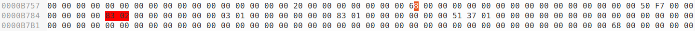
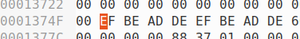
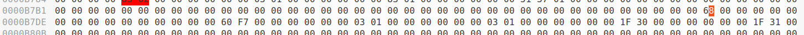
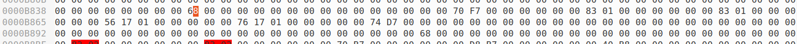
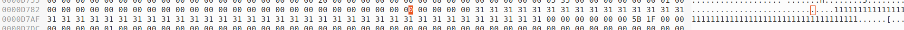

## Record Structure

So records are stored as arrays of `gints`, which are `0x08` byte values. Now there is no set schema for the records in a database, and two records can have a different number of values, with different types.

Now a record will have `0x03` gints which for it's header:

```
#define RECORD_HEADER_GINTS 3
```

### Value Encodings

So past that, the rest of the gints form the actual columns/values of the record. Now here are some of the potential dataypes a record can hold, here are only three of them:

```
int
char
string
record (ptr to another record)
```

Now typically, when a value is being stored, it is stored as one of two ways. If the value can actually be stored in the `0x08` byte slot, it will store it there. However if it can't, it will allocate a chunk of memory, and store the offset to it in the record. So it effectively either stores the value, or a ptr to the value.

Also, there are a ton of different datatypes, which can be stored in any slot in a record. How it tells the type of a value in a record, is via setting certain bits of the value stored in the record. For instance, if the lower `2` bits (so `0x03`) are set, that means that it is a small int, which we see from these values:

```
../whitedb.h:#define SMALLINTBITS    0x3       ///< int ends with       011

.	.	.

../whitedb.h:#define SMALLINTMASK  0x7
```

And this macro:

```
../whitedb.h:#define SMALLINTMASK  0x7
```

Also because of this, there are typically encoding/decoding values that are stored. That way you can take a value, encode it, store the encoded value, then when you retrieve that value, because of the encoding, you can tell what type it is, decode it, and then get the original value.

#### int

So int's come in one of two datatypes, small and full ints. The difference between these two is which bits of the int are set. If the upper three bits are set, it is a full int. If not, it is a small int. We see it from this Macro, and constant declaration:

```
./whitedb.h:#define fits_smallint(i)   ((((i)<<SMALLINTSHFT)>>SMALLINTSHFT)==i)

.	.	.

./whitedb.h:#define SMALLINTSHFT  3
```

So for these two datatypes, the primary difference in how they are stored is this. For smallints, the actual int value is encoded, then stored in the column. For fullints, space is allocated using the custom memory allocation functionallity of the database. The int is stored at the space, and the offset to that space (encoded first) is stored in the column. So tl;dr, for small ints the value is store, for full ints a ptr is stored.

We see that to encode a small int, it just shifts it over to the left by `SMALLINTSHFT`, than ors it with `SMALLINTBITS`. THis is so it can check if it is a small int via seeing if the bits that correspond to `SMALLINTBITS` are set:

```
../databases/whitedb/whitedb.h:#define encode_smallint(i) (((i)<<SMALLINTSHFT)|SMALLINTBITS)
```

Which we see that in action right here:

```
../databases/whitedb/whitedb.h:#define issmallint(i)   (((i)&SMALLINTMASK)==SMALLINTBITS)
```

And we see the constants here:

```
../databases/whitedb/whitedb.h:#define SMALLINTMASK  0x7

.	.	.

../databases/whitedb/whitedb.h:#define SMALLINTBITS    0x3       ///< int ends with       011

.	.	.

../databases/whitedb/whitedb.h:#define SMALLINTSHFT  3
```

So for full ints, it allocates the data, and encodes it:

```
    offset=alloc_word(db);

.	.	.

    return encode_fullint_offset(offset);
```

Which when we look at how it encodes it, it just ors the value with `FULLINTBITS` to mark it as a full int:

```
../databases/whitedb/whitedb.h:#define encode_fullint_offset(i) ((i)|FULLINTBITS)
```

Which we see it as just `0x1`:

```
../beyond_oblivion/whitedb/database_format.md:./whitedb.h:#define FULLINTBITS  0x1      ///< full int ptr ends with       01
```

And we see, it's used to identify it as a full int, similar to a small int:

```
../databases/whitedb/whitedb.h:#define isfullint(i)    (((i)&FULLINTMASK)==FULLINTBITS)
```

#### char

So chars as a datatype, are similar to that of small ints. When they are stored in a field (which I also call a column), their actual value is stored in there. We see that the `wg_encode_char` function basically just wraps the `encode_char` macro:

```
wg_int wg_encode_char(void* db, char data) {
#ifdef CHECK
  if (!dbcheck(db)) {
    show_data_error(db,"wrong database pointer given to wg_encode_char");
    return WG_ILLEGAL;
  }
#endif
#ifdef USE_DBLOG
/* Skip logging values that do not cause storage allocation.
  if(dbh->logging.active) {
    if(wg_log_encode(db, WG_CHARTYPE, &data, 0, NULL, 0))
      return WG_ILLEGAL;
  }
*/
#endif
  return (wg_int)(encode_char((wg_int)data));
}
```

Which we see, just shifts the chart over, and ors it with `CHARBITS` so it can be identified as a char. Since chars should only be `0x08` bits, we don't have to worry about it being too big to store in the field, like with ints:

```
../databases/whitedb/whitedb.h:#define encode_char(i) (((i)<<CHARSHFT)|CHARBITS)
```

Which we see the values for the shift, and the actual char bits used to identify it here:

```
../databases/whitedb/whitedb.h:#define CHARSHFT  8

.	.	.

../databases/whitedb/whitedb.h:#define CHARBITS  0x1f       ///< char ends with 0001 1111

.	.	.

../databases/whitedb/whitedb.h:#define CHARMASK  0xff
```

Which we see here, it is used to actually identify it:

```
../databases/whitedb/whitedb.h:#define ischar(i)   (((i)&CHARMASK)==CHARBITS)
```

#### string

So for strings, it uses the `wg_encode_str` function, which wraps the `wg_encode_unistr` function:

```
wg_int wg_encode_str(void* db, const char* str, char* lang) {
#ifdef CHECK
  if (!dbcheck(db)) {
    show_data_error(db,"wrong database pointer given to wg_encode_str");
    return WG_ILLEGAL;
  }
  if (str==NULL) {
    show_data_error(db,"NULL string ptr given to wg_encode_str");
    return WG_ILLEGAL;
  }
#endif
  /* Logging handled inside wg_encode_unistr() */
  return wg_encode_unistr(db,str,lang,WG_STRTYPE);
}
```

So looking at the `wg_encode_unistr` function, we see that it's similar to ints with how it stores it's data. If the string is small enough, it will simply store the stirng in the field/column with some bits set to mark it's type. We see that functionallity in action here:

```
  if (lang==NULL && type==WG_STRTYPE && len<(sizeof(gint)-1)) {
    res=TINYSTRBITS; // first zero the field and set last byte to mask
    if (LITTLEENDIAN) {
      dptr=((char*)(&res))+1; // type bits stored in lowest addressed byte
    } else {
      dptr=((char*)(&res));  // type bits stored in highest addressed byte
    }
    memcpy(dptr,str,len+1);
    return res;
  }
```

Which we see here, the value for those bits which mark the type as a tiny string:

```
../whitedb.h:#define TINYSTRBITS  0x4f       ///< tiny str ends with 0100 1111
```

However for longer strings, it will actually allocate a space in memory using the custom heap allocator. However there are two different types, short strings and long strings. Short strings have a set size to them, which we see is `32`:

```
  if (lang==NULL && type==WG_STRTYPE && len<SHORTSTR_SIZE) {
    // short string, store in a fixlen area
    offset=alloc_shortstr(db);
    if (!offset) {
      show_data_error_str(db,"cannot store a string in wg_encode_unistr",str);
#ifdef USE_DBLOG
      if(dbmemsegh(db)->logging.active) {
        wg_log_encval(db, WG_ILLEGAL);
      }
#endif
      return WG_ILLEGAL;
    }
    // loop over bytes, storing them starting from offset
    dptr = (char *) offsettoptr(db,offset);
    dendptr=dptr+SHORTSTR_SIZE;
    //
    //strcpy(dptr,sptr);
    //memset(dptr+len,0,SHORTSTR_SIZE-len);
    //
    for(sptr=(char *) str; (*dptr=*sptr)!=0; sptr++, dptr++) {}; // copy string
    for(dptr++; dptr<dendptr; dptr++) { *dptr=0; }; // zero the rest
    // store offset to field
#ifdef USE_DBLOG
    if(dbmemsegh(db)->logging.active) {
      if(wg_log_encval(db, encode_shortstr_offset(offset)))
        return WG_ILLEGAL; /* journal error */
    }
#endif
    return encode_shortstr_offset(offset);
    //dbstore(db,ptrtoffset(record)+RECORD_HEADER_GINTS+fieldnr,encode_shortstr_offset(offset));
  } else {
```

Which we see that size is `32`. If a string of size `20` gets allocated, a `32` byte buffer will still be allocated:

```
../whitedb.h:#define SHORTSTR_SIZE 32 /** max len of short strings  */
```

To mark it as a short string, we see that it just ors it with `0x06`:
```
../whitedb.h:#define encode_shortstr_offset(i) ((i)|SHORTSTRBITS)

.	.	.
../whitedb.h:#define SHORTSTRBITS  0x6      ///< short str ptr ends with  110
```

Long strings will be however long as the string is:

```
  } else {
    offset=find_create_longstr(db,str,lang,type,len+1);
    if (!offset) {
      show_data_error_nr(db,"cannot create a string of size ",len);
#ifdef USE_DBLOG
      if(dbmemsegh(db)->logging.active) {
        wg_log_encval(db, WG_ILLEGAL);
      }
#endif
      return WG_ILLEGAL;
    }
#ifdef USE_DBLOG
    if(dbmemsegh(db)->logging.active) {
      if(wg_log_encval(db, encode_longstr_offset(offset)))
        return WG_ILLEGAL; /* journal error */
    }
#endif
    return encode_longstr_offset(offset);
  }
```

We see that to encode it as a long string, it just ors it with `0x04`:
```
../whitedb.h:#define encode_longstr_offset(i) ((i)|LONGSTRBITS)

.	.	.

../whitedb.h:#define LONGSTRBITS  0x4      ///< longstr ptr ends with       100
```

Also in case it's not evident, to decode any of these datatypes, it effectively just zeroes out the bits used to mark the type type:

```
../whitedb.h:#define decode_longstr_offset(i) ((i) & ~LONGSTRMASK)
```

#### record

Now for records it will use the `wg_encode_record` function, which wraps the `encode_datarec_offset` macro:

```
// record

wg_int wg_encode_record(void* db, void* data) {
#ifdef CHECK
  if (!dbcheck(db)) {
    show_data_error(db,"wrong database pointer given to wg_encode_char");
    return WG_ILLEGAL;
  }
#endif
#ifdef USE_DBLOG
/* Skip logging values that do not cause storage allocation.
  if(dbh->logging.active) {
    if(wg_log_encode(db, WG_RECORDTYPE, &data, 0, NULL, 0))
      return WG_ILLEGAL;
  }
*/
#endif
  return (wg_int)(encode_datarec_offset(ptrtooffset(db,data)));
}
```

So in this API, records are effectively referenced as a offset. If you have a variable that is used to access a record, it holds an offset to that record. Now this just encodes it by not doing anything to it. This is because the type bits for the record is just that the lowest `3` bits are set to `0x00`. This is apparantly done as part of the memory allocation process, so it doesn't actually need to clear it out, which we see from these constants/macros:

```
../whitedb.h:#define encode_datarec_offset(i) (i)

.	.	.

../whitedb.h:#define isdatarec(i)    (((i)&DATARECMASK)==DATARECBITS)

.	.	.

../whitedb.h:#define DATARECBITS  0x0      ///< datarec ptr ends with       000

.	.	.

../whitedb.h:#define DATARECMASK  0x7
```

## Examples

Here are some examples of the records actually stored. To generate the db, I used this source code file:

```
#include "../Db/dbapi.h"

int main(int argc, char **argv) {
  void *db, *rec0, *rec1, *rec2, *rec3;
  wg_int int0, int1, int2, int3, string0, string1, string2, rec_enc0, rec_enc1, rec_enc2, char0, char1;

  db = wg_attach_database("2000", 3000000);
  rec0 = wg_create_record(db, 10);
  rec1 = wg_create_record(db, 10);
  rec2 = wg_create_record(db, 10);
  rec3 = wg_create_record(db, 10);

  int0 = wg_encode_int(db, 0x50);
  int1 = wg_encode_int(db, 0x20);
  int2 = wg_encode_int(db, 0x30);
  int3 = wg_encode_int(db, 0xdeadbeefdeadbeef);

  char0 = wg_encode_char(db, '0');
  char1 = wg_encode_char(db, '1');

  string0 = wg_encode_str(db, "guy", NULL);
  string1 = wg_encode_str(db, "00000000000000000000", NULL);
  string2 = wg_encode_str(db, "11111111111111111111111111111111111111111111111111", NULL);

  rec_enc0 = wg_encode_record(db, rec0);
  rec_enc1 = wg_encode_record(db, rec1);
  rec_enc2 = wg_encode_record(db, rec2);

  // Store the records
  wg_set_field(db, rec0, 0, int0);
  wg_set_field(db, rec0, 1, int1);
  wg_set_field(db, rec0, 2, int2);
  wg_set_field(db, rec0, 3, int3);

  wg_set_field(db, rec1, 0, int1);
  wg_set_field(db, rec1, 1, int1);
  wg_set_field(db, rec1, 2, char0);
  wg_set_field(db, rec1, 3, char1);

  wg_set_field(db, rec2, 0, int2);
  wg_set_field(db, rec2, 1, int2);
  wg_set_field(db, rec2, 2, string0);
  wg_set_field(db, rec2, 3, string1);
  wg_set_field(db, rec2, 4, string2);

  wg_set_field(db, rec3, 0, int0);
  wg_set_field(db, rec3, 1, int0);
  wg_set_field(db, rec3, 2, rec_enc0);
  wg_set_field(db, rec3, 3, rec_enc1);
  wg_set_field(db, rec3, 4, rec_enc2);

  // Dump the records
  wg_dump(db, "test-file");

  return 0;
}
```

Now to actually take a look at the db file `test-file`. Looking for the `rec0`, we see this:



Here we see the following values, `0x0283`, `0x0103`, `0x0183`, and the offset `0x013751`. This makes since, since we are storing the values `0x50`, `0x20`, and `0x30`, which encoded give us these values:

```
hex((0x50 << 3) | 3) = 0x0283
hex((0x20 << 3) | 3) = 0x0103
hex((0x20 << 3) | 3) = 0x0183
```

Now for the final one, is an offset of `0x013750`, which when we look at that memory location, we see the int value `0xdeadbeefdeadbeef`:



So next up, we have the char reord. We see it has the values `0x301f` and `0x311f`. This is what we expected since the chars being stored are `'0'` (`0x30`) and `'1'` (`0x31`). And to encode it, you will shift the byte over to the left by `0x08`, and or it by `0x1f`:



So next up, we have the string record. Looking at it, we see the offsets `0x011750`, `0x011770`, and `0x0074d0` (ignoring last 3 bits because they are type bits): 



Looking at the offsets `0x011750` and `0x011770`, we see the strings `guy` and `00000...`:


Then looking at the offset `0x0074d0`, we see the final string `1111111111111...`:

)

Finally, we have the record which stores the other records. We see it holds the offsets `0xB770`, `0xB7D8`, and `0xB840`. From the previous three records we saw, we see that is the offset to those three records as it should be:


